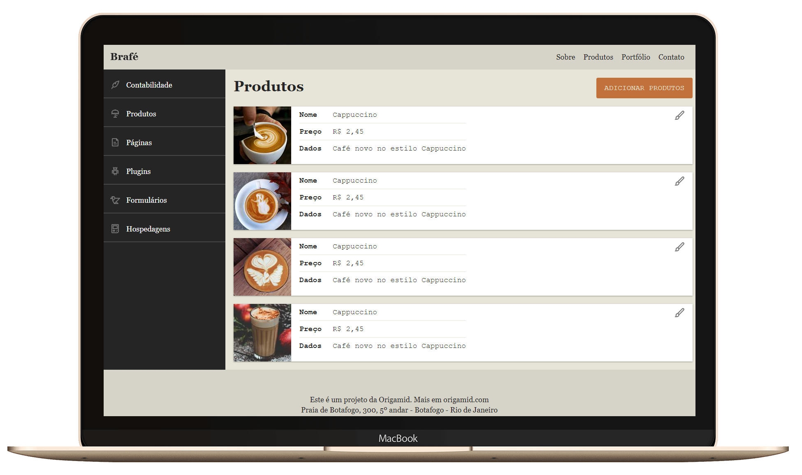

<h1 align="center">
    Brafé 3 :doughnut:
</h1>

<h4 align="center">
  Code and coffee ☕
</h4>

  <a href="#ghost-tecnologias">Codificação</a>&nbsp;&nbsp;&nbsp;|&nbsp;&nbsp;&nbsp;
  <a href="#computer-projeto">Projeto</a>

 

  

## :ghost: Codificação

Esse projeto foi desenvolvido das seguintes maneiras:

- [CSS Puro](https://github.com/brendamatias/brafe/tree/master/brafe-3/brafe-puro)
- [Flexbox](https://github.com/brendamatias/brafe/tree/master/brafe-3/brafe-flexbox)
- [Bootstrap](https://github.com/brendamatias/brafe/tree/master/brafe-3/brafe-bootstrap)

## :computer: Projeto

O projeto foi desenvolvido durante o curso de CSS Avançado - Posicionamento by <a href="https://github.com/origamid" alt="Origamid">Origamid</a> e sua codificação consiste em 3 diferentes formas para o mesmo layout.

## :round_pushpin: Acesse

O projeto desenvolvido pode ser visto:

- [CSS Puro](https://brendamatias.github.io/brafe/brafe-3/brafe-puro/)
- [Flexbox](https://brendamatias.github.io/brafe/brafe-3/brafe-flexbox/)
- [Bootstrap](https://brendamatias.github.io/brafe/brafe-3/brafe-bootstrap/)

---

### <a href="https://www.linkedin.com/in/brenda-matias/">LinkedIn</a>
